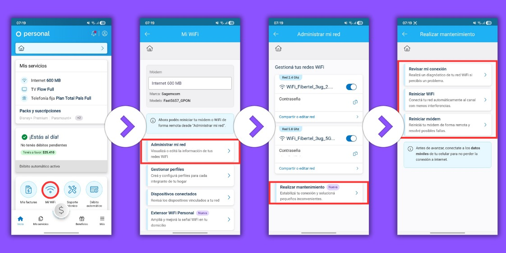
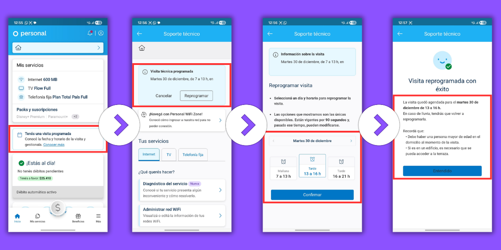
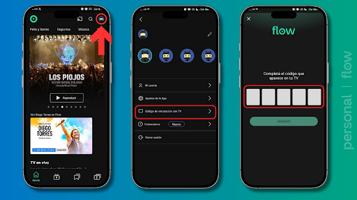

# Autogestión

<h2>📡 WiFi & Conectividad</h2>

  

    
    <a href="../assets/autogestion/administrar-red.png" download="Administrar_Red.png" class="dl-btn">⬇️ Descargar</a>
  

  

  

    
Cambio de contraseña (Wi-Fi)

    
Speech Sugerido

    ~~~text
    Te recuerdo que cualquier cosa también podés modificar la contraseña y nombre de tu red por la App Mi Personal Flow 📲.

    Acá te dejo una imagen con el paso a paso para que puedas realizarlo 🙌. 
    ~~~
  

  

    
    <a href="../assets/autogestion/mantenimiento-red.jpeg" download="Mantenimiento-red.png" class="dl-btn">⬇️ Descargar</a>
  

  

  

    
Realizar Mantenimiento

    
Speech Sugerido

~~~text
Te cuento que si volvés a tener inconvenientes con tu Wi-Fi 📶, podés probar optimizar la red directamente desde la App Mi Personal 📲.

Tenés que buscar la opción llamada "Realizar mantenimiento" 🛠️.

Esta función actualiza los radios y frecuencias de tu equipo automáticamente 📡. Es ideal para "limpiar" la señal y solucionar problemas de lentitud o cortes al instante 🚀.
~~~
  

  

    
    <a href="../assets/autogestion/DISPOSITIVOS-CONECTADOS.png" download="Dispositivos_Conectados.png" class="dl-btn">⬇️ Descargar</a>
  

  

  

    
Dispositivos conectados a Wi-Fi

    
Speech Sugerido

    ~~~text
    📱 Desde la App Mi Personal Flow, ingresando a la sección Mi Wi-Fi, vas a encontrar la opción "Dispositivos conectados".

    👀 Allí vas a poder ver en tiempo real quiénes están conectados a tus redes Wi-Fi, para que puedas controlar y gestionar los accesos fácilmente. 
    ~~~
  

  

    
    <a href="../assets/autogestion/CONTINUIDAD-GB.png" download="Continuidad_GB.png" class="dl-btn">⬇️ Descargar</a>
  

  

  

    
Wifi Backup

    
Speech Sugerido

  ~~~text
  Estuve analizando tu servicio para verificar lo que ocurre🧐 te comento que en este momento detectamos una falla general en tu zona y por ello, ya nos encontramos trabajando para poder devolverte el servicio a la brevedad, los trabajos suelen durar 24 hs aunque puede que se resuelva antes de ese tiempo! 

  Desde ya, te solicito disculpas por las molestias ocasionadas🙏 y te recordamos que desde nuestra App Mi Personal Flow podes seguir online activando los GB de continuidad🤗 Ingresas en la opción "hogar ver/servicios" donde podrás verificar afectación en zona, seguimiento y activación del pack para seguir navegando! Se tratan de 50GB  de uno libre sin costo adicional para que puedas activar en todas las lineas que tengas bajo la misma titularidad del servicio hogar, tendrán una duración de 24 horas❤
  ~~~
  

  

    
    <a href="../assets/autogestion/WIFI-ZONE.png" download="Wifi_Zone.png" class="dl-btn">⬇️ Descargar</a>
  

  

  

    
Personal Wifi Zone

    
Speech Sugerido

    ~~~text
    ¡Para que no pierdas conexión, te comento que contamos con la opción de que uses la red Personal Wifi Zone!

    Te dejo los pasos para acceder:

        Ingresá desde tu dispositivo a las redes wifi disponibles.
        Seleccioná la red Personal Wifi Zone.
        Ingresá tus datos de cliente (son los mismos que usas para entrar a Flow o a Mi Personal) y completá la cuenta de seguridad.
        Hacé clic en ingresar y ¡listo!

    Si necesitas registrarte o recuperar tu clave, podés hacerlo acá: https://regbf.telecom.com.ar/

    ✅ Dato importante: Podés conectar hasta 3 dispositivos de manera simultánea.
    ~~~
  

  

    
    <a href="../assets/autogestion/EXTENSORES.png" download="Extensores.png" class="dl-btn">⬇️ Descargar</a>
  

  

  

    
Extensores Wi-Fi

    
Speech Sugerido

~~~text
📱 Desde la app Mi Personal Flow, podés conseguir extensores de señal para que el WiFi 📶 llegue mejor a todos los rincones de tu casa.

Mirá la imagen que te dejamos con el paso a paso... ¡y listo, a disfrutar sin cortes! 😊 
~~~
  

  

    
    <a href="../assets/autogestion/Ubicacion-recomendada.png" download="Ubicacion_Recomendada.png" class="dl-btn">⬇️ Descargar</a>
  

  

  

    
Ubicación recomendada (Módem)

    
Speech Sugerido

    ~~~text
    Acá te muestro una foto donde se detalla lo recomendable 😊

    📶 Ubicá el módem vertical, a +1 m del piso, fuera de muebles.

    ⚠️ No debe haber dispositivos cerca que puedan generar interferencias en la señal Wi-Fi (microondas, teléfonos inalámbricos, espejos u otros electrodomésticos).

    🌐 Usá 2.4 GHz para alcance (50-60 Mbps) o 5 GHz para velocidad (menor alcance)
    ~~~
  

<h2>⚙️ Gestión de Cuenta</h2>

  

    
    <a href="../assets/autogestion/reagenda.png" download="Reagenda.png" class="dl-btn">⬇️ Descargar</a>
  

  

  

    
Modificación de agenda

    
Speech Sugerido

~~~text
📆 ¿Sabías que podés consultar, reagendar o cancelar tu visita técnica sin llamar ni esperar?
📲 ¡Todo desde la aplicación de Mi Personal Flow!
🔧 Sólo tenés que acceder a Soporte Técnico ➡️ Visita Técnica y desde ahí podés gestionar tu cita en segundos ⏱️
🖼️ Te adjunto una imagen explicativa para que lo veas más claro 🔗 Y si todavía no te has registrado, podés hacerlo desde acá: https://regbf.telecom.com.ar
~~~
  

  

    
    <a href="../assets/autogestion/DESENLISTAR-DISPOSITIVOS.png" download="Desenlistar_Dispositivos.png" class="dl-btn">⬇️ Descargar</a>
  

  

  

    
Desenlistar dispositivos

    
Speech Sugerido

    ~~~text
    Recordá que vas a poder hacer este tipo de modificaciones en tu cuenta siempre que lo necesites, desde nuestra app Flow.

    Te dejo el paso a paso:

    ➡️ Ingresando en tu perfil
    ➡️ Configuración de la cuenta
    ➡️ Allí mismo te saldrá la columna "Mis dispositivos" donde podrás visualizar los dispositivos conectados a la cuenta y eliminarlos si así lo deseas. 
    ~~~
  

  

    
    <a href="../assets/autogestion/GESTIONAR-SUSCRIPCIONES.png" download="Gestionar_Suscripciones.png" class="dl-btn">⬇️ Descargar</a>
  

  

  

    
Gestionar suscripciones

    
Speech Sugerido

  ~~~text
  ✨ Te recordamos que podés gestionar tus contenidos premium de manera rápida y sencilla desde nuestra app 📲. Solo tenés que ingresar a la sección de "Mi Cuenta" 👤 para activar, modificar o cancelar tus suscripciones cuando lo necesites, sin demoras ni llamadas ☎️.

  🛋️ Es simple, cómodo y está disponible estés donde estés 🌍. Si aún no tenés la app, podés descargarla desde tu tienda de aplicaciones. 
  ~~~
  

  

    
    <a href="../assets/autogestion/CODIGOTV.png" download="Codigo_TV.png" class="dl-btn">⬇️ Descargar</a>
  

  

  

    
Código de vinculación con TV

    
Speech Sugerido

    ~~~text
    📱➡️📺 Con tu celu podés iniciar sesión en Flow en la TV en pocos pasos.

    Mirá la imagen que te dejamos con el paso a paso y listo, ¡a disfrutar! 
    ~~~
  

