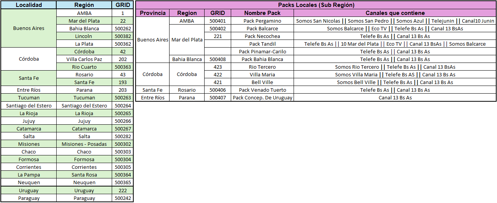

<style>
  /* === WIKI TÉCNICA === */
  
  :root {
    --bg-page: #050505;
    --card-bg: #161616;
    --accent: #d8b4fe;
    --accent-glow: rgba(216, 180, 254, 0.15);
    --border: #333;
    --md-header-height: 80px;
  }

   /* 1. NAVBAR */
  .md-header, .md-tabs { 
    background-color: #000000 !important; 
    border-bottom: 1px solid #222; 
    height: var(--md-header-height) !important;
  }
  .md-header__inner { height: 100% !important; align-items: center; }
  .md-header__title { font-weight: 900; letter-spacing: 1px; font-size: 1.2rem; }
  
  body {
    background-color: var(--bg-page) !important;
    background-image: radial-gradient(circle at 50% 0%, #1a0a2a, #050505 50%) !important;
    background-attachment: fixed !important;
  }
  .md-container, .md-main__inner { background: transparent !important; }

  /* 2. TIPOGRAFÍA */
  h1 {
    font-family: 'Segoe UI', sans-serif; font-weight: 900; font-size: 2.8rem;
    letter-spacing: -1px; margin-bottom: 40px !important; padding-bottom: 20px; 
    border-bottom: 4px solid #1a1a1a; text-transform: uppercase; display: flex; align-items: center;
    background: linear-gradient(to right, #fff, #999); -webkit-background-clip: text; -webkit-text-fill-color: transparent;
  }
  h1::before { content: '🛠️'; margin-right: 20px; font-size: 2.4rem; -webkit-text-fill-color: initial; }

  h2 {
    font-family: 'Segoe UI', sans-serif; font-size: 1.2rem; font-weight: 800;
    color: #fff; text-transform: uppercase; margin-top: 60px !important; margin-bottom: 20px;
    border-left: 6px solid var(--accent); background: linear-gradient(90deg, #1a1a1a, transparent);
    padding: 12px 20px; border-radius: 0 4px 4px 0;
    box-shadow: -5px 0 20px var(--accent-glow);
  }

  /* 3. ACORDEONES */
  .wiki-stack { display: flex; flex-direction: column; gap: 10px; }

  details.wiki-item {
    background: var(--card-bg); border: 1px solid var(--border);
    border-radius: 6px; overflow: hidden; transition: border-color 0.2s;
  }
  details.wiki-item:hover { border-color: #666; }

  summary.wiki-trigger {
    padding: 15px 25px; cursor: pointer; font-family: 'Segoe UI', sans-serif; 
    font-weight: 700; font-size: 0.95rem; color: #e0e0e0; background: #1a1a1a;
    display: flex !important; justify-content: space-between; align-items: center;
    list-style: none; user-select: none; text-transform: uppercase;
  }
  
  /* Reset marcadores */
  summary.wiki-trigger::-webkit-details-marker { display: none; }
  summary.wiki-trigger::marker { content: ""; display: none; }
  summary.wiki-trigger::after { content: '+'; font-family: monospace; font-size: 1.4rem; color: #555; }
  details[open] summary.wiki-trigger { background: #111; border-bottom: 1px solid #222; color: #fff; }
  details[open] summary.wiki-trigger::after { content: '-'; color: var(--accent); }

  .wiki-content { padding: 25px; background: #080808; color: #ccc; font-size: 0.95rem; }

  /* 5. IMÁGENES */
  .wiki-img-container {
    display: flex; justify-content: center; background: #000; padding: 10px; border-radius: 4px; border: 1px solid #222;
  }
  .wiki-img { max-width: 100%; height: auto; border-radius: 4px; display: block; }

  .tool-icon-img {
  width: 48px; /* Tamaño del icono */
  height: 48px;
  object-fit: contain;
  margin-bottom: 10px;
}

  /* 6. GRID PARA EMULADORES Y TDEs */
  .grid-tools {
    display: grid; grid-template-columns: repeat(auto-fill, minmax(180px, 1fr)); gap: 15px;
  }
  .tool-card {
    background: #111; border: 1px solid #333; padding: 15px; border-radius: 6px;
    text-align: center; transition: 0.2s; color: #fff; text-decoration: none;
    display: flex; flex-direction: column; align-items: center; justify-content: center;
  }
  .tool-card:hover { border-color: var(--accent); transform: translateY(-3px); }
  .tool-icon { font-size: 2rem; margin-bottom: 10px; }
  .tool-name { font-weight: 600; font-size: 0.9rem; }

  /* 7. TARJETAS TDE (ANIMACIÓN: APAGADO -> ENCENDIDO) */
  .tde-grid {
    display: grid;
    grid-template-columns: repeat(auto-fill, minmax(280px, 1fr));
    gap: 20px;
  }

  .tde-card {
    background: #0a0a0a; /* Fondo casi negro (Apagado) */
    border: 1px solid #222;
    border-left: 4px solid #444; /* Borde apagado */
    padding: 25px 20px;
    border-radius: 6px;
    transition: all 0.3s ease;
    display: flex; flex-direction: column; height: 100%;
    opacity: 0.8;
  }

  /* AL PASAR EL MOUSE (ENCENDIDO) */
  .tde-card:hover {
    background: #111;
    border-color: var(--accent);
    border-left-color: var(--accent); /* Se enciende */
    transform: translateY(-5px);
    box-shadow: 0 0 20px var(--accent-glow);
    opacity: 1;
    z-index: 10;
  }

  .tde-header { margin-bottom: 15px; }

  .tde-link {
    font-family: 'Segoe UI', sans-serif; font-size: 1.3rem; font-weight: 800;
    color: #888; /* Apagado */
    text-decoration: none; display: flex; align-items: center; transition: color 0.3s;
  }

  .tde-card:hover .tde-link { color: #fff; text-shadow: 0 0 10px var(--accent-glow); }

  .tde-link::before { content: '📄'; margin-right: 12px; font-size: 1.1rem; opacity: 0.5; transition: 0.3s; }
  .tde-card:hover .tde-link::before { opacity: 1; transform: scale(1.2); }

  .tde-desc {
    font-size: 0.8rem; color: #555; /* Apagado */
    line-height: 1.6; text-transform: uppercase; letter-spacing: 0.5px; font-weight: 500; transition: color 0.3s;
  }
  .tde-card:hover .tde-desc { color: #ccc; }

  /* 7. BOTONES LINKS */
  .link-btn {
    display: block; width: 100%; padding: 15px; background: #111; border: 1px solid #333;
    color: var(--accent); text-align: center; text-decoration: none; font-weight: bold;
    border-radius: 6px; margin-bottom: 10px; transition: 0.2s;
  }
  .link-btn:hover { background: #1a1a1a; border-color: var(--accent); color: #fff; }

  /* 8. TABLA DE CONTENIDOS (DERECHA) */
  .md-sidebar--secondary .md-nav__title {
    visibility: hidden; position: relative; height: 40px; margin-bottom: 15px;
    border-bottom: 2px solid var(--accent); box-shadow: 0 2px 10px var(--accent-glow);
  }
  .md-sidebar--secondary .md-nav__title::before {
    content: "ÍNDICE DE SECCIÓN"; visibility: visible; position: absolute; top: 0; left: 0;
    font-family: 'Segoe UI', sans-serif; text-transform: uppercase; font-weight: 900;
    letter-spacing: 1px; color: var(--accent); font-size: 1rem; line-height: 30px;
    text-shadow: 0 0 8px var(--accent-glow);
  }
  .md-sidebar--secondary .md-nav__link {
    font-family: 'Segoe UI', sans-serif; font-size: 0.95rem; padding: 8px 0; color: #888;
    transition: all 0.2s ease; display: block;
  }
  .md-sidebar--secondary .md-nav__link:hover { color: var(--accent); transform: translateX(5px); }
  .md-sidebar--secondary .md-nav__link--active {
    color: #fff !important; font-weight: 800; border-left: 4px solid var(--accent);
    padding-left: 15px; background: linear-gradient(90deg, var(--accent-glow), transparent);
    text-shadow: 0 0 12px var(--accent-strong-glow);
  }

    /*  EXTERMINADOR DE FOOTER */
  .md-footer, .md-footer__inner, .md-copyright, footer, .md-footer-meta, .md-footer-nav { 
    display: none !important; height: 0 !important; overflow: hidden !important; 
    padding: 0 !important; margin: 0 !important; border: none !important;
  }
  .md-content__button, .md-icon--edit, a[href*="edit"] { display: none !important; }

  /* === TOAST NOTIFICATION === */
  #clipboard-toast {
    visibility: hidden; min-width: 250px; margin-left: -125px;
    background-color: #333; color: #fff; text-align: center;
    border-radius: 4px; padding: 16px; position: fixed; z-index: 100;
    left: 50%; bottom: 30px; font-size: 17px;
    box-shadow: 0 5px 15px rgba(0,0,0,0.5); border: 1px solid var(--accent);
  }
  #clipboard-toast.show { visibility: visible; animation: fadein 0.5s, fadeout 0.5s 2.5s; }
  
  @keyframes fadein { from {bottom: 0; opacity: 0;} to {bottom: 30px; opacity: 1;} }
  @keyframes fadeout { from {bottom: 30px; opacity: 1;} to {bottom: 0; opacity: 0;} }

  /* FIX FINAL */
  summary.wiki-trigger::before, summary.speech-trigger::before{ content: none !important; display: none !important; }

</style>

# Wiki Técnica

<div id="clipboard-toast">Link copiado al portapapeles ✅</div>

## 📋 Gestión & Plantillas

<div class="wiki-stack">

  <details class="wiki-item">
    <summary class="wiki-trigger">💀 Masivo Vencido</summary>
    <div class="wiki-content">

    ```text
      💀 MASIVO VENCIDO 💀

      🗓️ Fecha de masivo en FAN:
      🎫 Ticket Global:
      🔢 S/N Equipo:

      🏷️ Nodo:
      📍 Región / Localidad:
      🆔 DNI:
      📞 Número de contacto del cliente:

      📡 Servicio afectado:
      🛑 Inconveniente reportado:

      🖼️ PRINT de pantalla adjunto
    ```

    </div>
  </details>

  <details class="wiki-item">
    <summary class="wiki-trigger">⚠️ Posible Masivo</summary>
    <div class="wiki-content">

    ```text
      ❌ Posible Masivo ❌

      S/N Equipo:
      MAC Address:
      Nodo:
      Región/Localidad:
      IP:
      HIBRIDO O FULL IP:
      DNI:
      Contacto:
      Inconveniente:
    ```

  </div>
  </details>

  <details class="wiki-item">
    <summary class="wiki-trigger">📲 Planilla Carga GB</summary>
    <div class="wiki-content">

    ```text
      Planilla Carga de GB

      ✔️Nombre del agente:
      ✔️Cuenta cliente:
      ✔️DNI cliente:
      🔌Nro de caso técnico o masiva:
      ✔️¿Recibió SMS de backup?:
      ✔️Motivo carga manual:
      ✔️Nro de línea:

      Verificado en SNAP
    ```

    </div>
  </details>

</div>

## 🛠️ Soporte Técnico

<div class="wiki-stack">

  <details class="wiki-item">
    <summary class="wiki-trigger">🆘 Códigos Reset Deco</summary>
    <div class="wiki-content">
      <div style="font-family: 'Consolas', monospace; font-size: 1.1rem; line-height: 2;">
        <div style="border-bottom: 1px solid #333; padding-bottom: 5px; margin-bottom: 10px;">
          🤖 <strong>DECO ANDROID:</strong> <span style="color:var(--accent)">1973 + LAST + OK</span>
        </div>
        <div style="border-bottom: 1px solid #333; padding-bottom: 5px; margin-bottom: 10px;">
          📡 <strong>DECO FULL IP:</strong> <span style="color:var(--accent)">1973 + MUTE + OK</span>
        </div>
        <div>
          🧬 <strong>DECO HÍBRIDO:</strong> <span style="color:var(--accent)">00009910</span>
        </div>
      </div>
    </div>
  </details>

  <details class="wiki-item">
    <summary class="wiki-trigger">🕹️ Configuración Control Remoto</summary>
    <div class="wiki-content">
      <h3 style="color:#fff; margin-top:0;">🏭 Reset de Fábrica</h3>
      <p style="color:#aaa;">Presionar <strong style="color:#fff; border:1px solid #555; padding:0 5px;">1</strong> y <strong style="color:#fff; border:1px solid #555; padding:0 5px;">6</strong> por 3 segundos hasta que el LED encienda. <br>Soltar e ingresar <strong style="color:var(--accent)">981</strong>.</p>
      <div style="height: 1px; background: #333; margin: 15px 0;"></div>
      <h3 style="color:#fff; margin-top:0;">📺 Configurar con TV</h3>
      <p style="color:#aaa;">Presionar <strong style="color:#fff; border:1px solid #555; padding:0 5px;">1</strong> y <strong style="color:#fff; border:1px solid #555; padding:0 5px;">3</strong> por 3 segundos.<br>Luego mantener <strong style="color:red; border:1px solid #555; padding:0 5px;">POWER</strong> hasta que TV se apague.</p>
    </div>
  </details>

  <details class="wiki-item">
    <summary class="wiki-trigger">🧮 Tipos de Flow</summary>
    <div class="wiki-content">
      <div class="wiki-img-container">
        
      </div>
      <div style="margin-top: 25px; padding-top: 20px; border-top: 1px solid #333; text-align: center;">
          <a href="https://basedeconocimientos.custhelp.com/app/answers/detail/a_id/7448/kw/flow" target="_blank" style="
            display: inline-flex; align-items: center;
            background: #161616; border: 1px solid var(--accent); padding: 12px 20px; border-radius: 4px;
            color: var(--accent); text-decoration: none; font-weight: bold; transition: 0.2s;
          ">
            <span style="margin-right: 10px;">📺</span> 
            Todo Flow
          </a>
        </div>
    </div>
  </details>

  <details class="wiki-item">
    <summary class="wiki-trigger">📊 Tabla de Velocidades</summary>
    <div class="wiki-content">
      <div class="wiki-img-container">
        
      </div>
    </div>
  </details>

  <details class="wiki-item">
    <summary class="wiki-trigger">🛜 Parámetros de Señal</summary>
    <div class="wiki-content">
      <div class="wiki-img-container">
        
      </div>
    </div>
  </details>

  <details class="wiki-item">
    <summary class="wiki-trigger">🏁 Grilla Flow</summary>
    <div class="wiki-content">
      <div class="wiki-img-container">
        
      </div>
      <div style="margin-top: 25px; padding-top: 20px; border-top: 1px solid #333; text-align: center;">
        <a href="https://click/customer/condiciones/condiciones/APPS/grillaCanales/"  class="copy-link" style="
          display: inline-flex; align-items: center;
          background: #161616; border: 1px solid var(--accent); padding: 12px 20px; border-radius: 4px;
          color: var(--accent); text-decoration: none; font-weight: bold; transition: 0.2s;
        ">
          <span style="margin-right: 10px;">🔻</span> 
          App Grillas
        </a>
    </div>
    </div>
  </details>

</div>


## 🔗 Herramientas & Recursos

<div class="wiki-stack">

  <details class="wiki-item">
    <summary class="wiki-trigger">📱 Emuladores</summary>
    <div class="wiki-content">
      <div class="grid-tools">
        <a href="https://basedeconocimientos.custhelp.com/euf/assets/CV/Emuladores/Flow/Flow%20App%20Android/FlowApp-Android.pdf" target="_blank" class="tool-card">
          
          <div class="tool-name">Flow App</div>
        </a>
        <a href="https://basedeconocimientos.custhelp.com/euf/assets/Telecom/Emuladores/Smarthome/Personal%20SmartHome.pdf" target="_blank" class="tool-card">
          
          <div class="tool-name">SmartHome</div>
        </a>
        <a href="https://basedeconocimientos.custhelp.com/euf/assets/CV/Emuladores/Flow/Mi-Personal-Flow.pdf" target="_blank" class="tool-card">
          
          <div class="tool-name">Mi Personal</div>
        </a>
        <a href="https://basedeconocimientos.custhelp.com/app/utils/login_form/redirect/answers%252Fdetail%252Fa_id%252F3969%252Fkw%252FEMULADOR" target="_blank" class="tool-card">
          
          <div class="tool-name">Decodificadores</div>
        </a>
      </div>
    </div>
  </details>

  <details class="wiki-item">
    <summary class="wiki-trigger">🏢 Listado de TDEs</summary>
    <div class="wiki-content">
      <div class="tde-grid">
        <div class="tde-card">
          <div class="tde-header">
            <a href="../assets/wiki/TDES/TDE (1).pdf" target="_blank" class="tde-link">#1 TDE</a>
          </div>
          <div class="tde-desc">
            ZONA PELIGROSA | CM APTOS | ESTADOS DE OT | AJUSTES | BAJAS EN FAN
          </div>
        </div>
        <div class="tde-card">
          <div class="tde-header">
            <a href="../assets/wiki/TDES/TDE (2).pdf" target="_blank" class="tde-link">#2 TDE</a>
          </div>
          <div class="tde-desc">
            CÁMARA FIJA | CÁMARA 360° | EMULADORES PARA LAS CÁMARAS Y SENSORES
          </div>
        </div>
        <div class="tde-card">
          <div class="tde-header">
            <a href="../assets/wiki/TDES/TDE (3).pdf" target="_blank" class="tde-link">#3 TDE</a>
          </div>
          <div class="tde-desc">
            BAJA ADICIONALES OPEN | BUSCAR NODOS OPEN | DESBLOQUEAR CLAVE OPEN
          </div>
        </div>
        <div class="tde-card">
          <div class="tde-header">
            <a href="../assets/wiki/TDES/TDE (4).pdf" target="_blank" class="tde-link">#4 TDE</a>
          </div>
          <div class="tde-desc">
            PARÁMETROS DE CODI+ | ¿PARA QUÉ SIRVEN? | ¿QUÉ SON? | ¿CÓMO SE MIDEN?
          </div>
        </div>
        <div class="tde-card">
          <div class="tde-header">
            <a href="../assets/wiki/TDES/TDE (5).pdf" target="_blank" class="tde-link">#5 TDE</a>
          </div>
          <div class="tde-desc">
            DIAGNÓSTICOS DE FTTH | COIP | SYMPHONICA | VER NODOS DE FTTH
          </div>
        </div>
        <div class="tde-card">
          <div class="tde-header">
            <a href="../assets/wiki/TDES/TDE (6).pdf" target="_blank" class="tde-link">#6 TDE</a>
          </div>
          <div class="tde-desc">
            TELEFONIA IP | TOIP | CASUÍSTICAS MÁS COMUNES | RESOLUCIONES | MARCACIONES
          </div>
        </div>
        <div class="tde-card">
          <div class="tde-header">
            <a href="../assets/wiki/TDES/TDE (7).pdf" target="_blank" class="tde-link">#7 TDE</a>
          </div>
          <div class="tde-desc">
            EXTENSORES | DETALLES | AUTOGESTIÓN
          </div>
        </div>
        <div class="tde-card">
          <div class="tde-header">
            <a href="https://gamma.app/docs/Descubriendo-Internet-Mas-Alla-de-la-Pantalla-ko7fej72iwxja9k?mode=doc" target="_blank" class="tde-link">#8 TDE</a>
          </div>
          <div class="tde-desc">
            DESCUBRIENDO INTERNET: MÁS ALLÁ DE LA PANTALLA
          </div>
        </div>
      </div>
    </div>
  </details>

  <details class="wiki-item">
    <summary class="wiki-trigger">🌐 Sitios de Consulta</summary>
    <div class="wiki-content">
      <a href="https://basedeconocimientos.custhelp.com/euf/assets/Telecom/Catalogo_Equipos/Catalogo_Equipos/Inicio.html" target="_blank" class="link-btn">
        📟 Catálogo de Módems y Equipos
      </a>
      <a href="https://tinyurl.com/2dvdymur" target="_blank" class="link-btn">
        ⚠️ Códigos de Error Flow
      </a>
    </div>
  </details>
</div>

## 📞 Directorio de Contacto

<div class="wiki-stack">
  <details class="wiki-item">
    <summary class="wiki-trigger">#️⃣ Números Telefónicos Útiles</summary>
    <div class="wiki-content">
      <style>
        .contact-table { width: 100%; border-collapse: collapse; }
        .contact-table th { text-align: left; padding: 12px; border-bottom: 2px solid var(--accent); color: #fff; font-weight: 700; }
        .contact-table td { padding: 12px; border-bottom: 1px solid #333; color: #aaa; }
        .contact-table tr:last-child td { border-bottom: none; }
        .contact-table td:nth-child(2) { font-family: 'Consolas', monospace; color: #fff; font-weight: 600; } 
        .contact-table td:nth-child(3) { text-align: right; font-size: 0.9rem; } 
      </style>
      <table class="contact-table">
        <thead>
          <tr>
            <th>Servicio</th>
            <th>Número de Contacto</th>
            <th style="text-align:right;">Horario</th>
          </tr>
        </thead>
        <tbody>
          <tr><td>Ventas</td><td>0800-555-0104 OPC2</td><td>8 a 24hs</td></tr>
          <tr><td>Mudanza</td><td>0800-199-0210</td><td>8 a 24hs</td></tr>
          <tr><td>Corporativo</td><td>0800-888-0800</td><td>24hs</td></tr>
          <tr><td>Arnet/Fibertel</td><td>0800-888-0112 OPC1-2-1</td><td>24hs</td></tr>
          <tr><td>Soporte</td><td>0800-555-3569 OPC1</td><td>24hs</td></tr>
          <tr><td>Administrativo</td><td>0800-555-3569 OPC2-2</td><td>24hs</td></tr>
          <tr><td>Personal Móvil</td><td>0800-444-0800 o *111</td><td>24hs</td></tr>
          <tr><td>Telefonía ex Telecom</td><td>0800-888-0114 o *114</td><td>24hs</td></tr>
          </tbody>
      </table>
      <div style="margin-top: 25px; padding-top: 20px; border-top: 1px solid #333; text-align: center;">
        <a href="https://basedeconocimientos.custhelp.com/euf/assets/Telecom/Aplicaciones/buscadorContactos/index.html" style="
          display: inline-flex; align-items: center;
          background: #161616; border: 1px solid var(--accent); padding: 12px 20px; border-radius: 4px;
          color: var(--accent); text-decoration: none; font-weight: bold; transition: 0.2s;
        ">
          <span style="margin-right: 10px;">🌐</span> 
          Medios de contacto
        </a>
      </div>
    </div>
  </details>

</div>

<script>
  document.addEventListener("DOMContentLoaded", function() {
    const copyLinks = document.querySelectorAll('.copy-link');

    copyLinks.forEach(link => {
      link.addEventListener('click', function(e) {
        e.preventDefault();
        const url = this.href;
        navigator.clipboard.writeText(url).then(() => {
          showToast();
        }).catch(err => {
          console.error('Error al copiar: ', err);
        });
      });
    });

    function showToast() {
      const x = document.getElementById("clipboard-toast");
      x.className = "show";
      setTimeout(function(){ x.className = x.className.replace("show", ""); }, 3000);
    }
  });
</script>